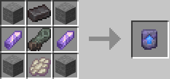

На сервере вы сможете увидеть новые необычные механики создания.

Все рецепты вам предстоит узнать самим, собирая записки в разных частях света жители, данжи, сундуки сокровищ и т.д. Исключениями будут крафты что доступны всем.

Информация о кол-ве крафтов будет доступна ниже: На данный момент кол-во рецептов:

- Верстак: 1
---
Пробужденный шаблон: 

 “Огурец” посередине падает с Визера.
Шаблон необходим для создания совмещенных элитр с нагрудником.
Поддерживаются все нагрудники, отделки и чары. 
![[1.png]]
 Блок света: 
![[2.png]]
 Буханка хлеба: 
![[3.png|265]]
 Угольный блок из древесного угля: 
![[4.png|265]]
